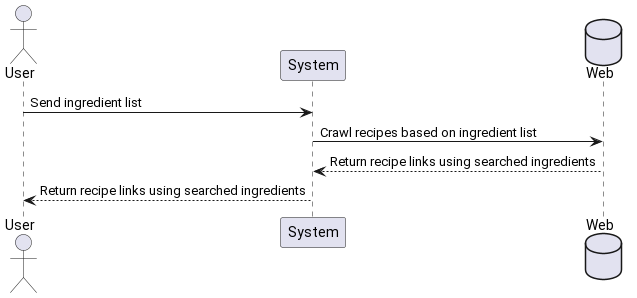

## get-me-food

Take as input a list of ingredients from the user. Based on the ingredients list, search the web for recipes which have as many ingredients as possible from the user list. Display the results.

For the times when we find ourselves looking at a frigde with random almost spoiled ingredients and don't have the time to search YouTube for ideas. Automatically search recipes based on the ingredients you want to get rid of.

